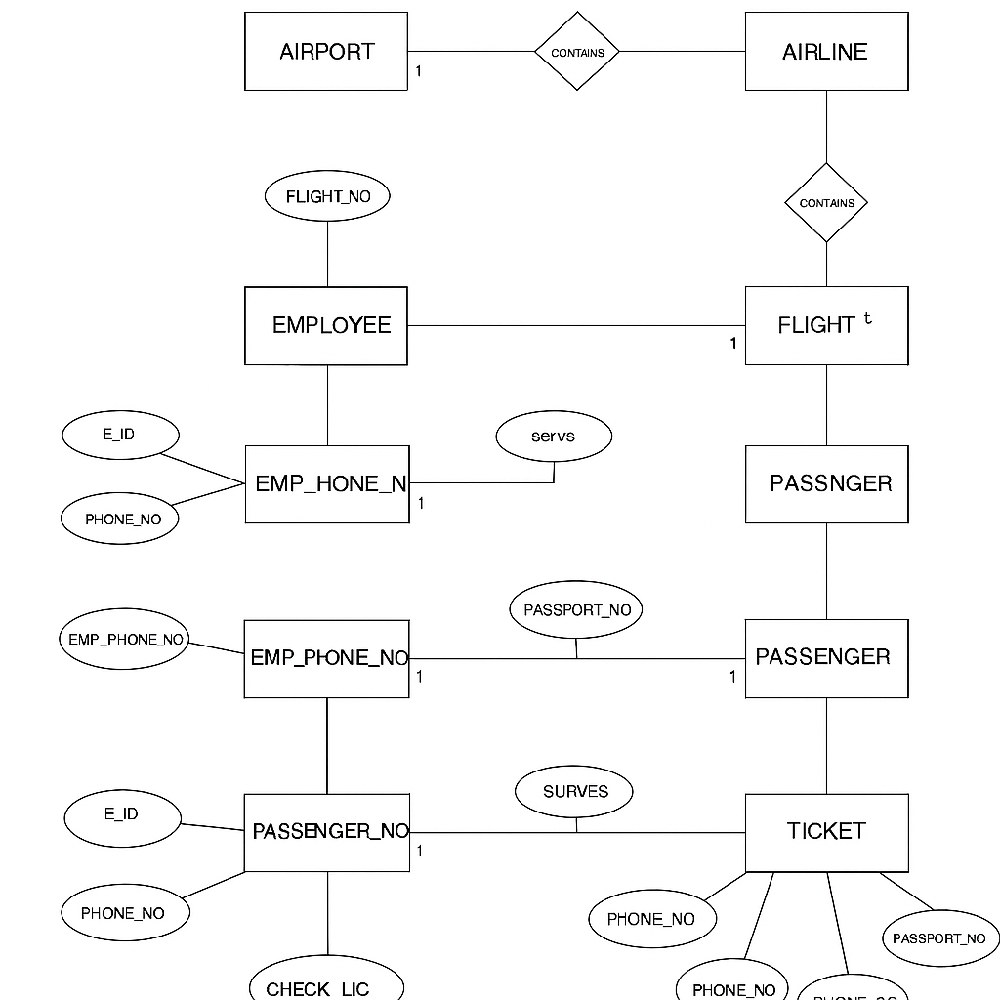

# Airport Management System (Oracle SQL)

A database project to manage airport operations — includes tables for Airports, Airlines, Employees, Flights, Passengers, and Tickets.  
Built using Oracle SQL with stored procedures, functions, triggers, and sample queries.

## Features
- **Relational Database Design** with 10+ tables & foreign key constraints
- **Stored Procedures** for adding Airports and Airlines
- **User-Defined Function** to get the number of employees at an airport
- **Trigger** for data validation (trimming input)
- **Complex Queries** for real-world analytics (e.g., total revenue, passengers by age group)
- **Sample Data** for easy testing

## How to Run
1. Open [Oracle Live SQL](https://livesql.oracle.com)
2. Run `airport_management.sql` (in blocks: Tables → Inserts → Procedures/Functions → Triggers)
3. Test using `sample_queries.sql`

## ER Diagram

## Author
Yashika Sharma
